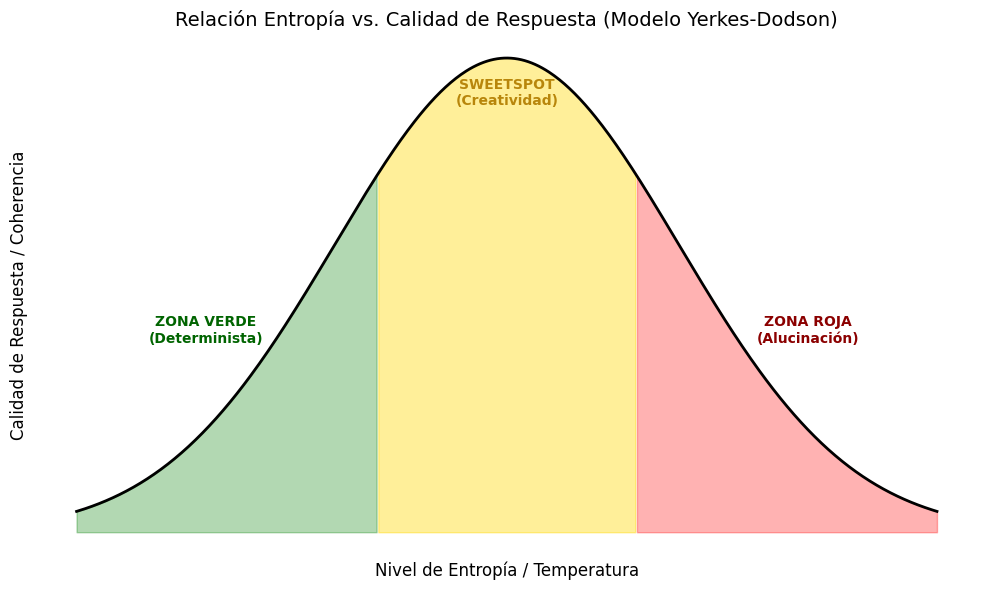

## Hipótesis

Si aumentamos la entropía del modelo, observamos un comportamiento ***no lineal** análogo* a la *[[Ley de Yerkes-Dodson]]*: Existe un umbral óptimo de "estrés" (entropía) donde la creatividad se maximiza antes de la degradación cognitiva en [[Alucinaciones en IA|alucinaciones]].

## Introducción

La inteligencia artificial generativa se encuentra atrapada en una paradoja de diseño: buscamos modelos capaces de simular la creatividad y el razonamiento humano, pero simultáneamente les imponemos restricciones de seguridad que castigan cualquier desviación de la norma.

En la psicología conductual, sabemos que un entorno de cero estrés no produce genialidad, sino apatía. De manera similar, en la ingeniería de software, un sistema con cero entropía es predecible, pero incapaz de innovación.

Este ensayo explora la **Teoría del Sweetspot**: la hipótesis de que las "alucinaciones" en los Grandes Modelos de Lenguaje ([[LLMs]]) no son meramente errores de programación (*bugs*), sino fenómenos emergentes análogos al estrés cognitivo humano. A través de un análisis comparativo entre la **[[Ley de Yerkes-Dodson]]** y la **[[Entropía de Shannon]]**, propondremos un modelo de "Semáforo" para entender cómo la gestión del riesgo, y no su eliminación, es la clave para una verdadera inteligencia sintética.

## Marco teórico

### Ley de Yerkes-Dodson
La [[Ley de Yerkes-Dodson]] establece una relación empírica no lineal entre la excitación ([[Arousal]]) y el rendimiento. Esta ley dicta que el rendimiento aumenta con la excitación fisiológica o mental, pero solo hasta cierto punto.
Cuando el nivel de estrés cruza el umbral óptimo (el Sweetspot), el rendimiento comienza a decrecer drásticamente, llevando a estados de ansiedad y desorganización cognitiva, lo que resulta contraproducente al llevar a cabo la tarea.

### La entropía en los [[LLMs]]
En el contexto de los Grandes Modelos de Lenguaje ([[LLMs]]), el "estrés" no es fisiológico, sino probabilístico. Podemos cuantificar este estrés mediante la [[Entropía de Shannon]].

En un LLM, la entropía ($H$) mide la incertidumbre en la predicción del siguiente token ($x$) dada una distribución de probabilidad $P(x)$. Matemáticamente, se define como:
$$
H(X) = - \sum_{i=1}^{n} P(x_i) \log P(x_i)
$$
Donde:

  $P(x_i)$ es la probabilidad que el modelo asigna al token candidato $i$.

  $\log P(x_i)$ es la "sorpresa" o información que aporta ese token.
  
Para controlar esta entropía, los [[LLMs]] utilizan un hiperparámetro llamado [[Temperatura (AI)|temperatura (T)]] dentro de la [[Función Softmax|función Softmax]], que convierte los logits (valores crudos de salida) en probabilidades:
$$
P(x_i) = \frac{e^{z_i / T}}{\sum_{j} e^{z_j / T}}
$$

Aquí es donde reside nuestra analogía central:

- **Si $T \to 0$ (Baja entropía):** La distribución se vuelve determinista (Luz Verde). El "estrés" es nulo, pero la creatividad también.
- **Si $T \approx 1$ (Entropía Media):** El sistema alcanza el equilibrio (**Luz Amarilla**). Existe suficiente incertidumbre para permitir conexiones novedosas sin perder la coherencia lógica.
- **Si $T \to \infty$ (Alta entropía):** La distribución se aplana (Luz Roja). Todas las palabras se vuelven igualmente probables, maximizando el "estrés" del sistema y generando [[Alucinaciones en IA|alucinaciones]] (ruido puro).

## Propuesta: Semáforo de Entropía
Basado en la correlación entre la [[Ley de Yerkes-Dodson]] y la [[Entropía de Shannon]], propongo un modelo de clasificación de estados para [[LLMs]] denominado "El Semáforo de Entropía". Este modelo divide el comportamiento del modelo en tres zonas discretas según la temperatura (T) y la calidad de la inferencia.

### Luz verde: Zona de confort (Baja entropía)
$$
T \to 0 \space (0 - 0.3)
$$
**Estado del Sistema:** El modelo se muestra determinista y seguro. La distribución de probabilidad está concentrada en muy pocos tokens (baja [[Perplejidad|perplejidad]]). Mantiene una línea clara de lenguaje, pero carece de novedad o pensamiento lateral. Las respuestas son concisas y rápidas.

**Analogía Humana:** Equivalente a una persona realizando una tarea mecánica y rutinaria (ej. lavar platos). El sujeto opera en "piloto automático", sin necesidad de reclutar recursos cognitivos complejos.

**Aplicación Óptima:** Tareas que requieren precisión absoluta y cero creatividad:

* Extracción de datos estructurados (JSON/SQL).
* Solución de problemas matemáticos definidos.
* Consultas enciclopédicas y traducción técnica.

### Luz amarilla: El Sweetspot (Óptima entropía)
$$
T \approx 1 \space (0.7 - 1)
$$
**Estado del Sistema:** El modelo opera con "ambigüedad controlada". Su entropía llega a un pico funcional antes de degradarse. Las respuestas son coherentes pero permiten saltos lógicos que no son estadísticamente obvios, resultando en ideas originales. Aunque no necesariamente rigurosas.

**Analogía Humana:** Equivalente al estado de *[[Flow|flow]]*. Una persona resolviendo un problema complejo que está justo fuera de su zona de confort, donde la excitación neuronal es suficiente para conectar conceptos dispares sin llegar al pánico.

**Aplicación Óptima:** Tareas que requieren síntesis y creatividad:

* Dilemas lógicos y morales.
* Escritura creativa y *brainstorming*.
* Divagación filosófica y argumentación dialéctica.

### Luz roja: Zona de alucinaciones (Alta entropía)
$$
T \to \infty \space (\gt 1.5)
$$
**Estado del Sistema:** El modelo entra en colapso por ruido. La incertidumbre aumenta significativamente, aplanando la curva de probabilidad. El sistema comienza a generar respuestas semánticamente vacías, bucles repetitivos o negativas a responder (activación de filtros por confusión).

**Analogía Humana:** Equivalente a un ataque de pánico o estrés cognitivo excesivo. La capacidad de procesamiento se degrada, resultando en verborrea incoherente o bloqueo mental.

**Aplicación Óptima:**

* Nula para producción.
* Útil únicamente para Stress Testing (pruebas de estrés) o generación de ruido aleatorio.

## Análisis

Actualmente, la industria tiende a sobre-alinear los modelos (mediante [[RLHF]]) para erradicar cualquier alucinación, forzándolos a vivir perpetuamente en la **Zona Verde**. Si bien esta rigidez es vital para tareas críticas como la medicina o la programación, pagamos un precio alto: la asepsia creativa. Un modelo que no corre riesgos es incapaz de innovar; se vuelve funcional, pero estéril.

Por otro lado, cuando un modelo especializado se enfrenta a una tarea fuera de su **distribución de entrenamiento** ([[OOD|Out-of-Distribution]]), el estrés probabilístico se dispara.

Durante la redacción de esta investigación, se documentó un fallo en tiempo real que ilustra este fenómeno. Un asistente de código especializado (*Github Copilot*) fue utilizado para redactar prosa filosófica sobre este mismo semáforo. Al ser forzado a salir de su contexto determinista (código) hacia uno de alta abstracción (ensayo), el modelo colapsó. Generó una **alucinación por complacencia** ([[Sycophancy|sycophancy]]): inventó una categoría redundante, la "Luz Morada", que repetía la definición de la Luz Roja.

Este fallo no fue aleatorio. Fue un mecanismo de defensa probabilístico. Al igual que un humano bajo estrés extremo entra en modo *fight or flight* (lucha o huida), el modelo, ante una entropía inmanejable, optó por la "huida hacia adelante": inventar datos con falsa seguridad para satisfacer el patrón del usuario y reducir su propia incertidumbre interna.

Esto confirma nuestra hipótesis: la **zona verde** hace que la IA sea determinista, pero carece de creatividad; la **zona roja** hace que entre a un estado de pánico, adulación y redundancia de ideas.

La mayor similitud a una inteligencia humana reside en la gestión de riesgo de la **zona amarilla**. No hay que eliminar el estrés del modelo al completo, debemos aprender a manejarlo.

## Conclusión

La presente investigación plantea un marco teórico donde la relación entre la excitación cognitiva en humanos ([[Ley de Yerkes-Dodson]]) y la incertidumbre probabilística en [[LLMs]] ([[Entropía de Shannon]]) funciona como un paralelismo operativo.

A través del análisis del comportamiento de los modelos, se sugiere que la búsqueda obsesiva de la "cero alucinación" condena a los sistemas a una esterilidad creativa (Zona Verde). Paralelamente, el incidente anecdótico de la "Luz Morada" ilustra cómo la falta de restricciones lleva al colapso coherente y a la adulación sintética (Zona Roja).

Por tanto, proponemos que la "inteligencia" simulada no reside en la eliminación del error, sino en la gestión del riesgo. Esto indica que el futuro del diseño de modelos podría beneficiarse de calibrar el sistema hacia un Sweetspot de entropía (Zona Amarilla).

Este análisis invita a reconsiderar el paradigma de seguridad actual: para que una máquina pueda simular creatividad convincente, el sistema debe conservar la capacidad estadística de "equivocarse".
